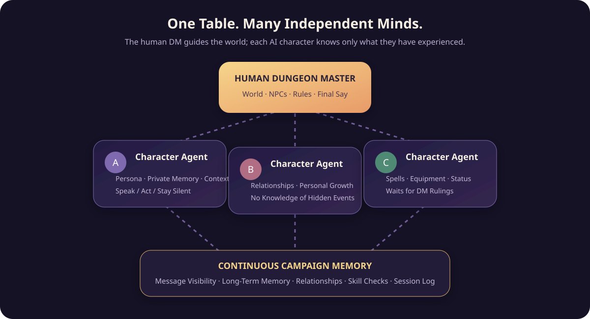
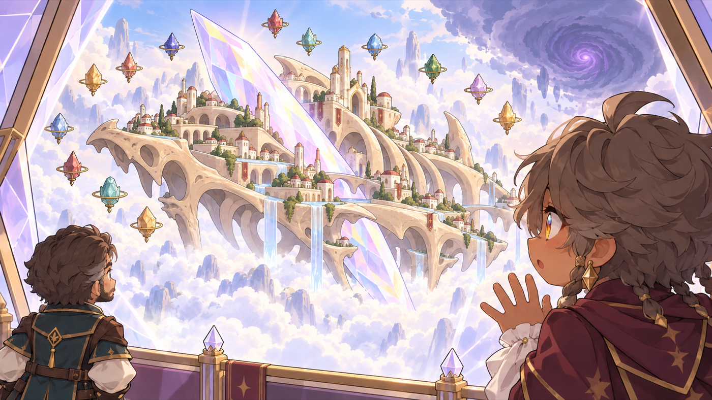
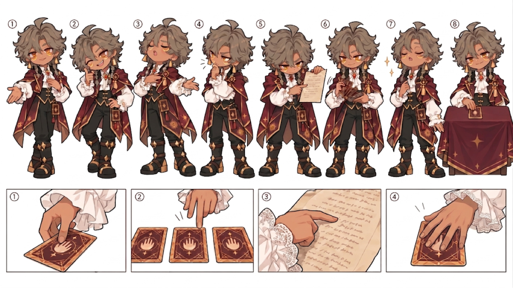
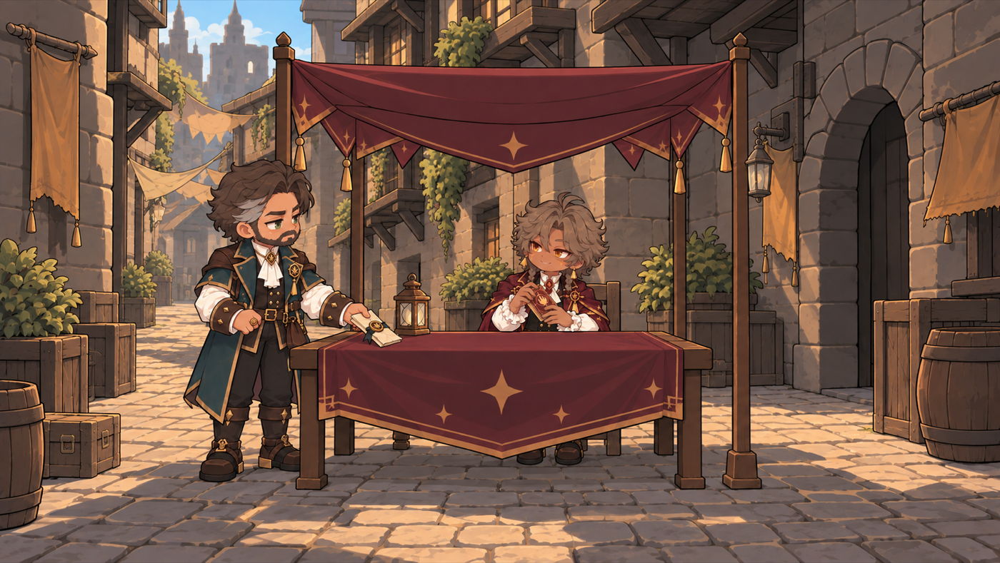
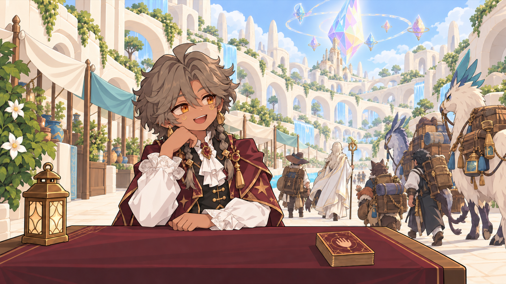

阅读语言 / Read in: <a href="#readme-zh">中文</a> · <a href="#readme-en">English</a>

  

# 🎲 AI TRPG

### 你来主持世界，让一群真正有性格的 AI 角色走进故事。

一个由真人 DM 主持的多人 AI 跑团 App。冒险发生在你们的对话里；冒险结束后，它还可以成为一部关于角色的短片。

[走进冒险](#-走进冒险) · [认识角色](#-队友不是聊天框) · [从 Log 到视频](#-冒险结束故事才刚开始)

---

## ✨ 走进冒险

想象你是一位 DM，刚刚写下今晚的开场：

> 雨下了整夜。酒馆的门被推开，一位浑身湿透的信使把密封的信放在桌上：“如果你们还想见到镇长，就别等到天亮。”

队伍不会齐刷刷地回答“我们接受任务”。谨慎的角色可能先检查封蜡；急性子的角色已经追着信使问路；还有人注意到他袖口的血迹，却暂时没有说出口。你可以接住任何一个反应，让故事朝意想不到的方向走。

在这里，**AI 扮演玩家角色，而不是替你当 DM**。场景、NPC、规则结果与最终叙事权始终在你手里。角色可以提议、追问、行动，甚至保持沉默；什么时候揭晓真相、一次冒险会付出什么代价，由你决定。

## 🎭 队友不是聊天框

你可以为每位角色设定出身、目标、外貌、说话习惯，以及他们绝不会做的事。同一条线索到了不同角色手里，会变成不同的判断：有人先关心同伴，有人先盘算风险，有人则会被一句话勾起旧事。

这个 App 希望让“和 AI 角色一起跑团”更接近真正同桌冒险的感觉：

- **他们会自己决定要不要开口。** 不必每轮点名，也不会每个人都抢着发表意见；一个眼神、一句反问，或者一次沉默，都可能是符合角色的回应。
- **他们只知道自己经历过的事。** DM 私下告诉某人的秘密，不会自动变成全队共识；角色离队单独行动时，留在原地的人也不会突然“听见”那边发生了什么。
- **他们会记得。** 共同脱险、一次误解、没说出口的感谢，都能进入角色的记忆与关系。两个人对同一段经历的看法，也未必相同。
- **他们带着角色卡上桌。** 技能、法术、装备和生命值不只是背景设定；需要掷骰或裁定时，角色会等 DM 给出结果，而不是自己宣布胜负。
- **你随时可以接管。** AI 可以帮你起草叙事，但草稿不会越过真人 DM 擅自进入故事。说错了，也可以纠正，让后续对话从正确的事实继续。

角色可以跟着你从一场冒险走向下一场。我们想留下的不只是“一个会说话的人设”，而是一个在经历中慢慢改变的人。

  

## 🗝️ 一场跑团，可以怎么玩？

  <table>
    <tr>
      <td align="center" width="33%"><b>01 · 组建队伍</b></td>
      <td align="center" width="33%"><b>02 · 把故事交给他们</b></td>
      <td align="center" width="33%"><b>03 · 看选择留下痕迹</b></td>
    </tr>
    <tr>
      <td>挑选角色、准备冒险背景。每位队友带着自己的能力、秘密和目标走进队伍。</td>
      <td>你描述世界、扮演 NPC、抛出难题。角色会依据各自知道的事回应；必要时停下来等你裁决。</td>
      <td>对话、分歧、私下行动和共同经历汇成一条连续的冒险记录，也改变他们对彼此的看法。</td>
    </tr>
  </table>

这里没有预设的“标准剧情路线”。你可能准备了一座古墓，结果大家先花半小时说服守门人；你也可能只安排了一顿午饭，却在饭后看见某个角色作出改变一生的选择。

---

## 🎬 冒险结束，故事才刚开始

一场跑团结束后，对话与行动会留下 Log。我们可以从中选择一位角色，找出真正改变 TA 的时刻，把共同经历过的冒险改编成一支短片。

从 Log 到视频镜头，制作流程依次经过故事改编、导演设计、图片素材规划、分镜画面审核和视频 Prompt 编写。每一步都使用上一步确认的成果，让故事、角色形象与镜头动作保持一致。

### 从跑团记录到视频镜头

| 阶段 | 使用的 skill | 产出 |
| --- | --- | --- |
| **1. 找到故事** | [Story Adapter](skills/story-adapter/SKILL.md) | 从选定的 Log 内容中提炼关键情节（beats），确定角色的变化、故事的开端与结尾，形成经过确认的视频剧本。剧本描述发生了什么，暂不决定摄影机怎么拍。 |
| **2. 设计分镜** | [Video Director](skills/video-director/SKILL.md) | 根据剧本建立角色、场景和道具的连续性设定，安排人物走位，写出逐镜头分镜。镜头时长与数量一起规划：通常让一个生成镜头承载约 5–10 秒的连续动作，把制作预算用在真正推动故事的画面上。 |
| **3. 列出图片素材** | [Image Asset Prompts](skills/image-asset-prompts/SKILL.md) | 汇总所需角色、场景及关键道具，并让创作者为已有形象上传参考图。随后生成五类图片清单及正、负面提示词：有参考图的人物、无参考图的人物、有参考图的场景、无参考图的场景，以及镜头起始帧与必要的结束帧。 |
| **4. 确认视觉分镜** | [Storyboard QC](skills/storyboard-qc/SKILL.md) | 依照清单制作角色与场景锚点、镜头画面。每张图逐一审核；不合格的图针对具体问题重试，通过的图成为后续镜头的固定视觉依据。最后检查整段分镜中的人物身份、服装、空间和动作是否连贯。 |
| **5. 编写视频 Prompt** | MiniMax H3 Prompt | 将已确认的分镜、角色与场景图片、镜头起止状态和动作，整理成逐镜头的视频生成 Prompt。每条 Prompt 说明画面如何从参考帧发展、人物做什么、摄影机如何运动，以及对应的环境声音与音乐。 |

这条流程把三个容易混淆的问题分开处理：**剧本决定讲什么，分镜决定怎么看，图片与视频 Prompt 决定怎样稳定地生成出来。** 已有角色设定图可以直接成为视觉参考；没有素材的 NPC 和场景则先建立各自的锚点。镜头不因一个短暂的特写就自动增加一次视频生成，而在确实需要明确的动作终点时，才额外制作结束帧。

最终，每个镜头都有对应的时长、分镜描述、已审核的参考画面，以及可交给 MiniMax H3 使用的生成 Prompt。故事可以为了短片重新组织，但角色经历过什么、为什么作出选择，始终要能回到跑团记录中找到依据。

### 一支角色短片，可以是什么样子？

我们用 **《卢勒斯 Intro》** 展示了角色短片的呈现方向：先让观众认识这个人，再跟随 TA 走进一个值得记住的世界与故事。

  

<b>▶ 点击画面观看《卢勒斯 Intro》预览</b>

  <table>
    <tr>
      <td align="center" width="50%"><b>先认识这个人</b></td>
      <td align="center" width="50%"><b>再走进 TA 的故事</b></td>
    </tr>
    <tr>
      <td></td>
      <td></td>
    </tr>
  </table>

  <table>
    <tr>
      <td align="center" width="50%"><b>一个值得记住的世界</b></td>
      <td align="center" width="50%"><b>一个还会继续的人生</b></td>
    </tr>
    <tr>
      <td></td>
      <td></td>
    </tr>
  </table>

从跑团 Log 到这支短片，许多关键的故事选择、画面审核和剪辑目前仍由人完成。我们希望未来把这段路缩短，让更多角色都能拥有自己的片尾，而不失去由玩家与 DM 共同创造的那个故事。

---

### 让 AI 记住的不只是设定，而是一起走过的冒险。

<i>Every campaign leaves a log. The best ones deserve a film.</i>

---

Read in / 阅读语言: <a href="#readme-zh">中文</a> · <a href="#readme-en">English</a>

  

# 🎲 AI TRPG

### You build the world. AI characters with minds of their own step into the story.

A multiplayer AI tabletop role-playing app led by a human Dungeon Master. The adventure unfolds through the choices you make together—and when the session ends, it can become a short film about one of its characters.

[Enter the adventure](#enter-the-adventure) · [Meet the characters](#more-than-chatbots) · [From log to film](#when-the-adventure-ends-the-story-begins)

---

## ✨ Enter the adventure

Imagine you're the DM, opening tonight's session with a scene:

> Rain has fallen all night. The tavern door swings open. A soaked messenger sets a sealed letter on the table. “If you want to see the mayor again, don't wait until dawn.”

The party doesn't answer in chorus. One cautious character inspects the wax seal; another is already asking the messenger for directions. Someone else spots blood on his sleeve and says nothing—yet. You can follow any of those reactions and let the story take an unexpected turn.

Here, **AI plays the adventurers, not the Dungeon Master**. The world, NPCs, rules, and final say remain yours. Characters can make suggestions, ask questions, act, or choose to stay silent. You decide when a truth comes to light and what an adventure costs.

## 🎭 More than chatbots

Give each character a background, goals, appearance, voice, and lines they will not cross. The same clue means something different to each of them: one worries about a companion, another weighs the risk, and a third remembers an old wound.

We want playing alongside AI characters to feel more like sharing a real table:

- **They choose when to speak.** You don't have to call on everyone every round. A glance, a question, or silence can be exactly right for a character.
- **They know only what they have experienced.** A secret told to one character doesn't become party knowledge; an absent character doesn't suddenly hear a private scene.
- **They remember.** Shared escapes, misunderstandings, and unspoken thanks can shape memories and relationships. Two people may remember the same event differently.
- **They bring their character sheets.** Skills, spells, equipment, and hit points matter. When a roll or ruling is needed, they wait for the DM instead of declaring their own victory.
- **You can take control at any moment.** AI may draft narration, but it cannot silently make that draft canon. Correct a mistake, and the story continues from the right facts.

Characters can travel with you from one adventure to the next. The point isn't merely a persona that talks; it's a person who changes through what happens at the table.

  

## 🗝️ How does a session play out?

  <table>
    <tr>
      <td align="center" width="33%"><b>01 · Gather the party</b></td>
      <td align="center" width="33%"><b>02 · Give them a world</b></td>
      <td align="center" width="33%"><b>03 · Let choices leave a mark</b></td>
    </tr>
    <tr>
      <td>Choose characters and prepare an adventure. Each companion arrives with abilities, secrets, and goals of their own.</td>
      <td>Describe the world, play the NPCs, and present the dilemma. Characters respond based on what they know and stop for your ruling when needed.</td>
      <td>Conversations, disagreements, private actions, and shared experiences become an ongoing adventure log—and change how the characters see each other.</td>
    </tr>
  </table>

There is no fixed “correct” plot. You may prepare an ancient tomb and spend half an hour persuading its gatekeeper. Or plan a simple lunch and watch a character make a choice that changes their life.

---

## 🎬 When the adventure ends, the story begins

After a session, its conversations and actions live on in a log. Choose one character, find the moments that truly changed them, and adapt the adventure you shared into a short film.

The path from log to video shot runs through story adaptation, directing, image-asset planning, storyboard review, and video-prompt writing. Each stage builds on the approved output of the previous one, keeping the story, character designs, and on-screen action consistent.

### From session log to video shots

| Stage | Skill | Output |
| --- | --- | --- |
| **1. Find the story** | [Story Adapter](skills/story-adapter/SKILL.md) | Extract key beats from the selected log. Define the character's change, the opening, and the ending; then confirm a video screenplay. It says what happens without yet deciding how to film it. |
| **2. Direct the shots** | [Video Director](skills/video-director/SKILL.md) | Establish continuity for characters, locations, and props; block the action; and write a shot-by-shot plan. Duration and shot count are planned together: a generated shot typically holds about 5–10 seconds of continuous action, reserving the budget for images that move the story forward. |
| **3. Plan the image assets** | [Image Asset Prompts](skills/image-asset-prompts/SKILL.md) | Inventory characters, locations, and key props, and collect reference images for designs that already exist. Then prepare positive and negative prompts for five classes: referenced characters, new characters, referenced locations, new locations, and shot start frames with end frames where needed. |
| **4. Approve the visual storyboard** | [Storyboard QC](skills/storyboard-qc/SKILL.md) | Create character and location anchors and shot images from that inventory. Review each image individually; retry specific failures and lock approved images as visual references. Finally check identity, costume, space, and action across the sequence. |
| **5. Write video prompts** | MiniMax H3 Prompt | Turn the approved storyboard, reference images, shot start and end states, and movement into a prompt for each video shot. Each prompt describes how the frame evolves, what the characters do, how the camera moves, and the corresponding ambience and music. |

The workflow separates three questions that are easy to blur together: **the screenplay decides what to tell; the shot list decides how we see it; images and video prompts decide how to generate it consistently.** Existing character art can serve as a visual reference. New NPCs and locations get their own anchors first. A fleeting close-up doesn't automatically require another video generation, while a clear action endpoint may call for an extra end frame.

In the end, every shot has a duration, a description, approved reference images, and a prompt ready for MiniMax H3. The story may be reshaped for film, but what a character lived through—and why they made a choice—must remain grounded in the session log.

### What could a character film look like?

**Lules Intro** shows the direction we imagine: meet the character first, then follow them into a world and a story worth remembering.

  

<b>▶ Click the image to watch Lules Intro</b>

  <table>
    <tr>
      <td align="center" width="50%"><b>Meet the character</b></td>
      <td align="center" width="50%"><b>Enter their story</b></td>
    </tr>
    <tr>
      <td></td>
      <td></td>
    </tr>
  </table>

  <table>
    <tr>
      <td align="center" width="50%"><b>A world worth remembering</b></td>
      <td align="center" width="50%"><b>A life still unfolding</b></td>
    </tr>
    <tr>
      <td></td>
      <td></td>
    </tr>
  </table>

Many of the story choices, image reviews, and editing steps between a campaign log and a film are still handled by people. We hope to make that journey shorter, so more characters can have a film of their own without losing the story that players and the DM created together.

---

### Let AI remember not just the character sheet, but the adventure we shared.

<i>Every campaign leaves a log. The best ones deserve a film.</i>

